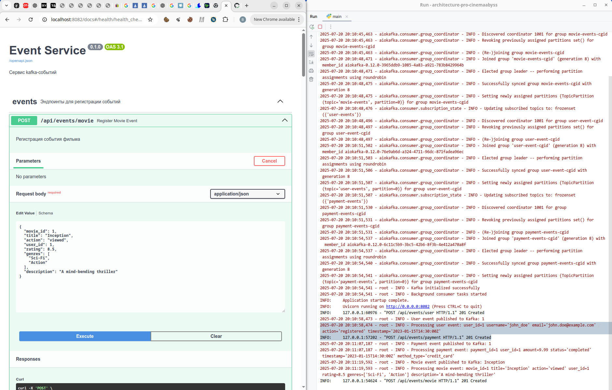
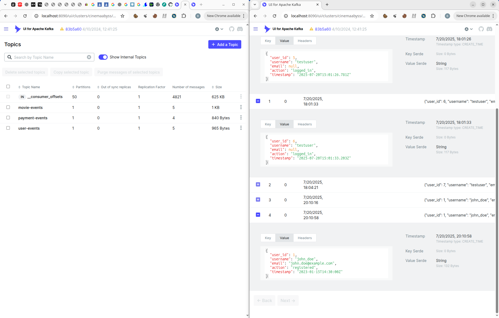
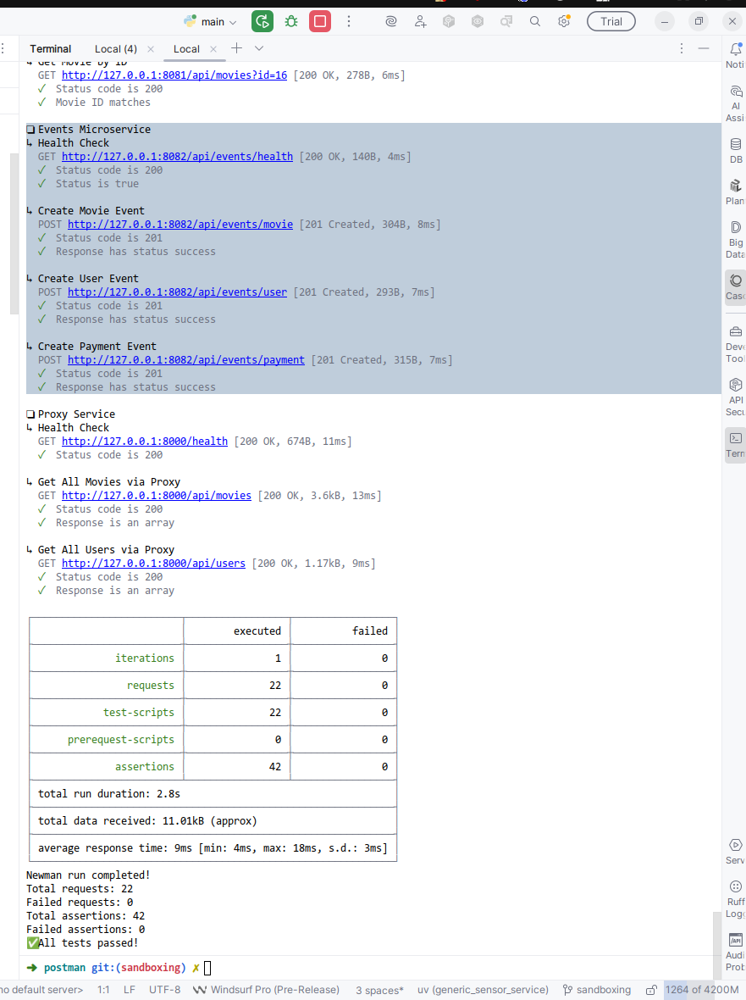
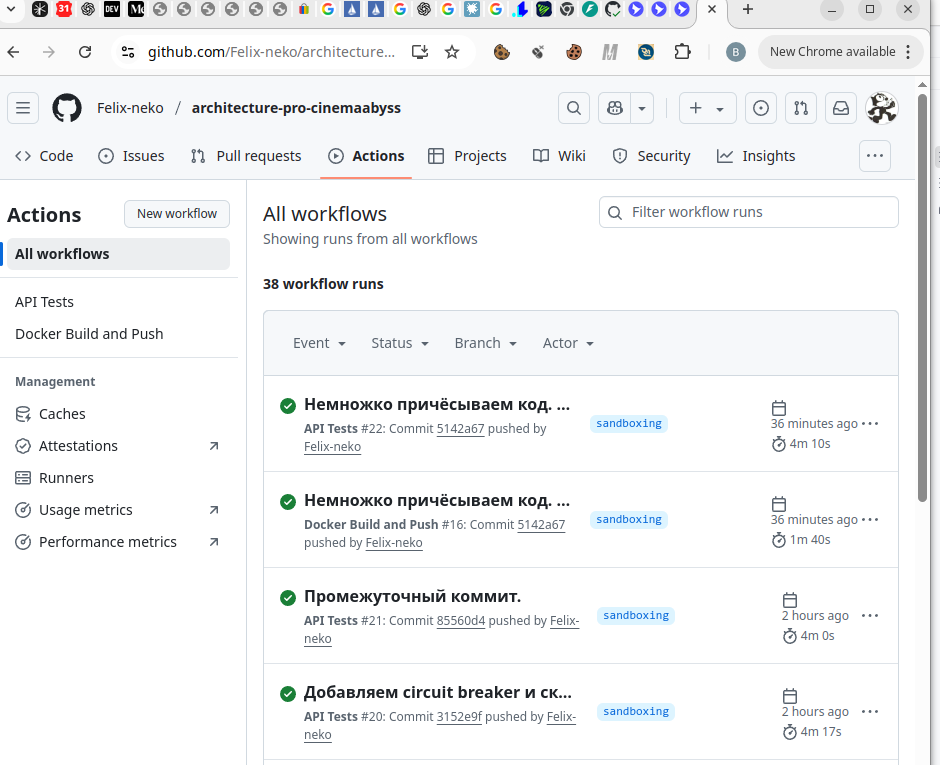
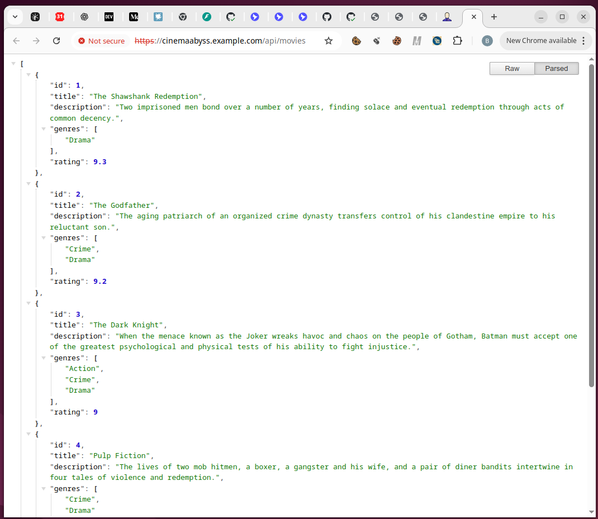
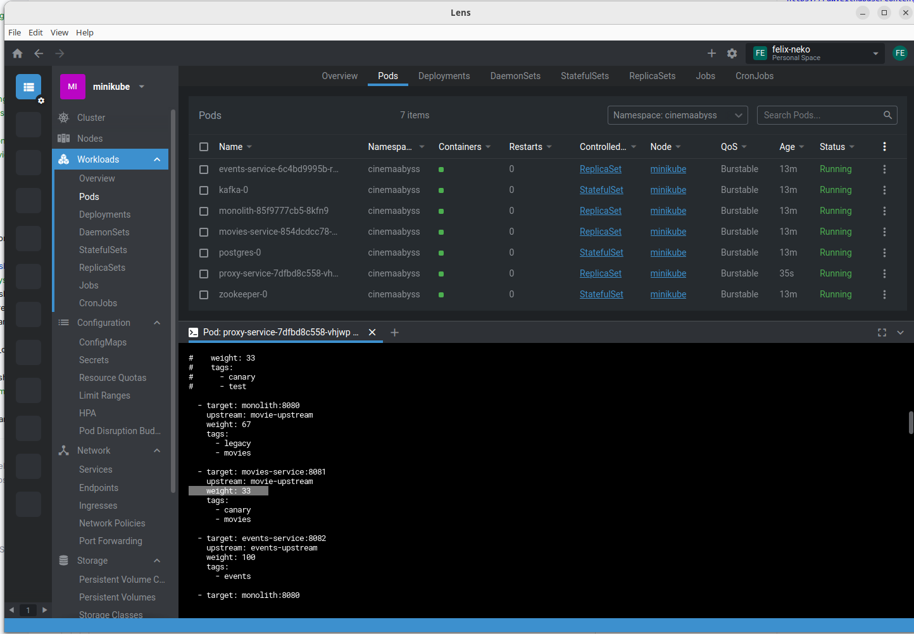

## Изучите [README.md](README.md) файл и структуру проекта.

## Задание 1: TOBE-архитектура "Кинобездны"

### Домены и контексты
[Описание основных доменов и контекстов](./diagrams/domains.md)

### Диаграмма контейнеров

![Container Diagram](https://www.plantuml.com/plantuml/png/hLbPRnl94NwVNz5c0bW2U3mu--BO1dp8zcPzAAOIFmG1CUIqg0796MPcg2E10KbUMxkGruON6s1X9DuraXz0qwH5IwJy1_8myuzILJr7znoKDeWFsUpkggxwwkpYXRwZjtiww-exzi1ZRezxkgKppnbmpRFxpBDPq_OykySCq-4jpxGjJTCkc5QhEp0us_2yldkvLdFqhMhRz3O6pO7BdPPjUTpogYsxL-jtTSiRzBeLrpEwPhDsypULLLpwm_rxjPxkUjo1fSPDeD1DYplLFfpLBiONLAiryKUcon9e5mo-3X_PhPK_VddpuOFwEIJp1dtTS2ub4fgmMrc74nMtxvWUToC13Rw9Usvyo-s73zQkFrwfFxo_yd-zYDRqBUxQFLxv8e4vqghMt_4sR4ledBDhkrxRuUvVkaKd7AwtlDIcf4mDHNSNxFVifjdb3Rth5TzWc8iuyEtMXcwrytZ8nmpTqvkwoqFpkXtJwkkEtcEMxV4rlkrTxvfjgmSGiovVzpJjkc6iT3akhEdjfPAtOJf61KYydLAP_RhPlcbtRUTgwLVhN-1lMhCTWplX-YtTwTnnT3gCLWYNRtJrLWVNkhpDBGCllbhot_Yd_ip_33_d_iIV1_l18GlsWdt_DDYbnRa_3Pun_pDzdFf7_WZ-7SFYFfm_WR-VIiiGHfxfTJdptyBv4t_eV_Bd5VyOpi-14PuS0kVTommfOVi3S1l2lJD_o1YSEyMRaHTAGJUDD6qLx6TRIsZ7CYlvFy7gIV02981Tv8Vt1ozA2_PgSCaOBfcI5die0cs2RYXqVGSyjTUuOGyiGtTsbjOTydIZuTA6Yvp_BM00qk-0oRWIx0bESC4iE2mjixzf37x5CRoqnPiDlTz7sk_XqFiAGJS5L4xzZmWn_7-2GlzEtzJhBSViUsNs27qPRIE2w6g9d1jaL7dt8M1unFqVmF0zCWQz0ML_mefk8kxiWUwPcro-98a0kEb91Wx0VPCx2HZ-ExBDY7xEWqEuKKM3mPL3zjMWoHsBGof03m1d40U0Pf95I--RZRRkyIrz1mIzllfb9VW6D7hf7uNAF-BT15BrzAEL-XggTtTjRRKk7PTGMaoGbcNWRJHGQRF54U18NT2GWHPFIKtqqsdmDK1x36lFuTyfmpz3VnG63SP8j8EAH0ujIQY8bResJojC54ntbQCDNAHT_EN_2zny0bVjvuYAmWWPA0nVC8htJBnW_9KJZYCMx5U3WoeB3eJr_2DOf03zHlWMcZ-6A3Yi9hG_0nv747h3u3LA1F47SY0uCm5Dy9BvfunaEWbUKNx9ZU1NLQsGAMMau02KVLbuGv6YCTCbe9m5hyfaGDeV0WymBHeLzFV7LM42I0iiHZnZ1wZjog8cn4v7L7DzFGmdCF2DsxShAe1nDb7z4gb4g0egTfy-W9C0680HYxH212WLZ9OBs40aXJmUysR206CQCXL80vaRCH3qJxHyZrK4alsroCMJgtDE9w2mIkMQ0YExp92WpF2ubexNdhrfyePfhTk5KPjn2mnLSBolmxo9gyyagMK3vR9FoPyM2TfAkmU56qe-T9T5Ob4m7LFXnImzZaJxp_C2KGhPfiMHaqK-KIfj_4IoZB6KK4b-JndY46D191CG3fi0pFO9LUWraEV2ADp3W1bXmCa9ufEI88hKbdFESV0Tq4Ao2fxIzKL8LRCncQykgox48Ms_JTFWnTu4_u084n0dwLZmvx30R6bkESwVkTgpuH732ptd6LbfBggxYDopPKh9KNJJ6Rxj3fekjIiBF9loxHX-mWSKIKu8IfahO5QGJ6HGpqUfXa8UJIeGte6u60JV2iSlOrSwf0vsecfrZ8NXQM71akedq9-GTURO6ar5d_i1dLY4ZZ3O0KNS7fQwZ4yNoWrkdRUNDbbVty5NHA6rJa6B4n7n1MXdEUIbdFZ6tm_uW2zrzFMEtcWwTeSwzw_mOuKI37eft0_qqgC6Eb9FRxjNfQL469LNWV7bvYyjS4gOy6WskRChM7taqzeJrOjIh7CowMdoE68HjE0M7z5b5ZPHKGUWcAGgUoTwubXEp0iw7dhfF4L_XQOKq-cp6gMCtAtu4f5hePtQfVzX4W775RrPeiaG5qO2foHnGnksJ-5pgARyT3w8tf5ZYeoJJ6Jbn40ATUoqSWsXHMPAt3UnaFy3TKZ3u2L29zKjXFoOaIMEg0D63R_5fb1H11-hOIlg_nq-dc0upm78ZzXlGT_2IB_tr6U7jqYL4wrrnCZgUnJsc3YEwM6jt0B-8p2Ly5Igx5IqxsCga1_WX5fY8n7_6P9CiMu6ksN4MNZVM3IBioY_dN7JkUetTLJ8P2OBBsnxJ3sxU7L4Zw7WQLa2xpBHL7BrF0qzOnY5YjItiINLqyvkzIRBlrrq5z2WMc2MCYCJunJZE7pU2RMdoOWaUjYX7Fle7WpVtAWOgguOY0O7X0RAkBz02asBNJ_bnU3sLScpeRx5EVTMCzKx64qnV9ZZEr34CeN_96aVS4Wm1J-VB6eWW4lzafAfIxcfMcenqZr5Zc1KdADOpQPXAMRVKMv0a3-AZAgu0xvx4jjYv2WsbAmsYpIYY5Ym4uNFQ-6qvtm-CBh-eyZAdqb8272WV8KcnSfEaIz2H0G-zide8L0Kq4WlHTm8rr5BnMUK3Tq3DZ-mx4GD5Q-4fp1VlnPBaIO_K5B2f-r9D11Awmwd2P48EobBOqbw5XSqIInALKTXXaEUeiIB70WrOpzfwpFvXRY-m1f2aXr1BuKZ7tf0C59jB8Pt9CjC5BHzqJbKa_Wey1mi3zcjnE6KLbZojMHy8kaMZqkI6FbCG68IEqmUpz5a4Ojgx9oeJSuyhfPwQuSexPBBOL0UH2KZVDkBdR0Idz_-CL1PZJ6NL5Kaj0n2QYHBI45jeVH8tWigGDXDiXKn16GkTjJXKpOO5Fb59n3vJnmKmhTmb3WI6GrG-aIzb9Bcg1ufcIoA1Sd41pI-3iN9rEdw9RfmDnetnPBVlLUlABuGEcOMxHpqM8AvkWlONnJjuvG0Z6VhyLmt5cKYX_6CkfKnnizUQZ0x4u35ercQjOl49_UUuJ6bo_6dcZhtPPK_RPY6mQq_6_QM1IroEgThwOKC1T_sk6FftKXZLwEQ8GRxoRoyj2mjowDkB1a0qVSBPezOJgCUHxHP4_7i6eNU06lFuuWbvmLE4opHiRj4uyZm2yIB_Z0p4ize4bRQGhbefAV5ay2LRI_X8R-8psIqS0ADfVhAbOZnjMlPhoNevhPjjt7UhmwSxz1gfO1_z6L9bjjc9yq957Zpo_buxJIVjJjdSw6tMNQkK0Xkxkm_poh2cyFlF1UOXvog-AikC7sPoJR9dUtIrHRtrhlcTlxDSF43iLzQBg3NU_fVuJdST-mUBsHodGwnLSViyK9EGDD2iY8cQsA_aDxSD0jf_Hy1m1yBIUrEnowcVUk_WTzl2wctJAjJIFqODalAH3lFxj6Z4c04UxkcrVu5iPcCJz45gFsK7ytu9MbHY6QLSJt7xFEqG3PEB-eUx1IYuDXDkwExhfvBw_zCpU0f08bVoUt58y8ierRN7XWX3pUNsKqyiHgUKC5LMSNufiUmqTSW2hBdd1XdmSHPpKLyCeo2Lr0giQwTgzRbZ4VFpWJfN89Cyhuj-DyuPIPOvtJHF5v5NnoSQPLCkgpVVVYuSM_bpig3MqlBsdy1)
Диаграмма контейнеров "Кинобездны" (TOBE-архитектура)


## Задание 2

### 1. Proxy

В этот раз я решил заморочиться и применить тот самый Kong, про который нам любезно написали на курсе.
Чтобы низкая латентность, дополнительные возможности по логированию, поддержка sticky sessions и иже с ним.

Kong и правда многое умел, но есть одна пичалька: в бесплатной версии Kong нельзя просто так взять и пробросить переменные среды в конфиги.
Да и if-блоки, похоже, тоже так просто не поиметь (чтобы нужные секции включались и выключались в зависимости от других переменных среды)
Хинт: возможно, я плохо искал. Если это таки возможно, то напишите, буду знать ))

В итоге я запилил [Dockerfile](./src/microservices/proxy/Dockerfile), где настроечки Kong параметризуются в зависимости от того, 
что писано в переменной среды ``MOVIES_MIGRATION_PERCENT``.

Параметризация происходит при старте Docker-контейнера, делается через ``sed``, чтобы не тащить лишних зависимостей. 
Отдельную настройку ``GRADUAL_MIGRATION`` не реализовывал, полное включение-выключение нового сервиса тестировал,
выставляя ``MOVIES_MIGRATION_PERCENT=0`` и ``MOVIES_MIGRATION_PERCENT=100``

Postman-тесты гонял, вроде проходило ))s

P.S. Для ручного тестирования я ещё риспользовал сервисы-заглушки `test-old-movie-service` и `test-new-movie-service` с различающейся страницей, сейчас они закомментированы.
Это делалось, чтобы получить 2 резко отличающиеся страницы.


### 2. Kafka

В этой задаче я сделал небольшой сервис на `FastAPI` + `aiokafka`
Там есть 3 эндпоинта регистрации событий, которые пишут события в kafka-топики (см. [OpenAPI-спецификацию](./src/microservices/openapi.yaml)).

И там есть 3 метода-обработчика, которые вызываются, когда один из kafka consumer'ов, слушающих соответствующиий топик,
получает и обрабатывает там сообщение (уже в виде pydantic-объекта). Сейчас я просто печатаю в логи, что именно мы получили через kafka.


Скриншот: регистрируем событие через kafka и смотрим логи kafka consumer'ов...



Скриншот: смотрим Kafka Web UI и проверяем, что события в топиках точно появились


Скриншот: запускаем postman-тесты (environment: local)


P.S. AsyncAPI в этот раз не делал. Если есть средства, как его генерировать автоматом из Python-кода, то дайте знать, буду признателен.


## Задание 3

### CI/CD

Я доработал пайплайн сборки [docker-build-push.yml](./.github/workflows/docker-build-push.yml):
- чтобы он отрабатывал при коммите не только в main, но и в sandboxing
- чтобы он заливал в Docker Registry туда не только образа `monolith` и `movies-service`, но и `events-service` и `proxy-service`.

И я немножко доработал пайплайн сборки [api-tests.yml](./.github/workflows/api-tests.yml), чтобы он отрабатывал на каждый коммит нне только в `main`, но и в `sandboxing`.
Что там доработать ещё, я не особо понял: вроде там и собирается весь `docker-compose.yaml` и честно тестируется под `newman`. 

"Зелёные" сборки и тесты вроде появились = )


Скриншот: зелёные сборки и тесты

Логи с последней сборки -- [пригалаю](./ci_cd_logs).

### Proxy в Kubernetes

- Кубер-конфиги я заполнил, см. [`src/kubernetes/`](./src/kubernetes)

- minikube создавал со следующими параметрами: [`create_minikube.sh`](./src/kubernetes/create_minikube.sh) 
- также добавил в `/etc/hosts` на хост-машине тот IP, что выдал мне `minkube ip` под именем `cinemaabyss.example.com`
- установка кубер-ресурсов: см. [`kube_install_cinemaabyss.sh`](./src/kubernetes/kube_install_cinemaabyss.sh)

`http://cinemaabyss.example.com/api/movies` теперь возвращает список фильмов:


Скриншот: вывод списка фильмов из кубера


Поды в Lens появились, Kong-конфиг у `proxy-service` при перезапуске пода параметризуется в соответствие 
с `MOVIES_MIGRATION_PERCENT` из конфиг-мапа...

Тесты с environment=kubernetes запустил, вроде всё проходит, см. логи.


#### Шаг 1
Для деплоя в kubernetes необходимо залогиниться в docker registry Github'а.
1. Создайте Personal Access Token (PAT) https://github.com/settings/tokens . Создавайте class с правом read:packages
2. В src/kubernetes/*.yaml (event-service, monolith, movies-service и proxy-service)  отредактируйте путь до ваших образов 
```bash
 spec:
      containers:
      - name: events-service
        image: ghcr.io/ваш логин/имя репозитория/events-service:latest
```
3. Добавьте в секрет src/kubernetes/dockerconfigsecret.yaml в поле
```bash
 .dockerconfigjson: значение в base64 файла ~/.docker/config.json
```

4. Если в ~/.docker/config.json нет значения для аутентификации
```json
{
        "auths": {
                "ghcr.io": {
                       тут пусто
                }
        }
}
```
то выполните 

и добавьте

```json 
 "auth": "имя пользователя:токен в base64"
```

Чтобы получить значение в base64 можно выполнить команду
```bash
 echo -n ваш_логин:ваш_токен | base64
```

После заполнения config.json, также прогоните содержимое через base64

```bash
cat .docker/config.json | base64
```

и полученное значение добавляем в

```bash
 .dockerconfigjson: значение в base64 файла ~/.docker/config.json
```

#### Шаг 2

  Доработайте src/kubernetes/event-service.yaml и src/kubernetes/proxy-service.yaml

  - Необходимо создать Deployment и Service 
  - Доработайте ingress.yaml, чтобы можно было с помощью тестов проверить создание событий
  - Выполните дальшейшие шаги для поднятия кластера:

  1. Создайте namespace:
  ```bash
  kubectl apply -f src/kubernetes/namespace.yaml
  ```
  2. Создайте секреты и переменные
  ```bash
  kubectl apply -f src/kubernetes/configmap.yaml
  kubectl apply -f src/kubernetes/secret.yaml
  kubectl apply -f src/kubernetes/dockerconfigsecret.yaml
  kubectl apply -f src/kubernetes/postgres-init-configmap.yaml
  ```

  3. Разверните базу данных:
  ```bash
  kubectl apply -f src/kubernetes/postgres.yaml
  ```

  На этом этапе если вызвать команду
  ```bash
  kubectl -n cinemaabyss get pod
  ```
  Вы увидите

  NAME         READY   STATUS    
  postgres-0   1/1     Running   

  4. Разверните Kafka:
  ```bash
  kubectl apply -f src/kubernetes/kafka/kafka.yaml
  ```

  Проверьте, теперь должно быть запущено 3 пода, если что-то не так, то посмотрите логи
  ```bash
  kubectl -n cinemaabyss logs имя_пода (например - kafka-0)
  ```

  5. Разверните монолит:
  ```bash
  kubectl apply -f src/kubernetes/monolith.yaml
  ```
  6. Разверните микросервисы:
  ```bash
  kubectl apply -f src/kubernetes/movies-service.yaml
  kubectl apply -f src/kubernetes/events-service.yaml
  ```
  7. Разверните прокси-сервис:
  ```bash
  kubectl apply -f src/kubernetes/proxy-service.yaml
  ```

  После запуска и поднятия подов вывод команды 
  ```bash
  kubectl -n cinemaabyss get pod
  ```

  Будет наподобие такого

  NAME                              READY   STATUS    

  events-service-7587c6dfd5-6whzx   1/1     Running  

  kafka-0                           1/1     Running   

  monolith-8476598495-wmtmw         1/1     Running  

  movies-service-6d5697c584-4qfqs   1/1     Running  

  postgres-0                        1/1     Running  

  proxy-service-577d6c549b-6qfcv    1/1     Running  

  zookeeper-0                       1/1     Running 

  8. Добавим ingress

  - добавьте аддон
  ```bash
  minikube addons enable ingress
  ```
  ```bash
  kubectl apply -f src/kubernetes/ingress.yaml
  ```
  9. Добавьте в /etc/hosts
  127.0.0.1 cinemaabyss.example.com

  10. Вызовите
  ```bash
  minikube tunnel
  ```
  11. Вызовите https://cinemaabyss.example.com/api/movies
  Вы должны увидеть вывод списка фильмов
  Можно поэкспериментировать со значением   MOVIES_MIGRATION_PERCENT в src/kubernetes/configmap.yaml и убедится, что вызовы movies уходят полностью в новый сервис

  12. Запустите тесты из папки tests/postman
  ```bash
   npm run test:kubernetes
  ```
  Часть тестов с health-чек упадет, но создание событий отработает.
  Откройте логи event-service и сделайте скриншот обработки событий

#### Шаг 3
Добавьте сюда скриншота вывода при вызове https://cinemaabyss.example.com/api/movies и  скриншот вывода event-service после вызова тестов.


## Задание 4
Для простоты дальнейшего обновления и развертывания вам как архитектуру необходимо так же реализовать helm-чарты для прокси-сервиса и проверить работу 

Для этого:
1. Перейдите в директорию helm и отредактируйте файл values.yaml

```yaml
# Proxy service configuration
proxyService:
  enabled: true
  image:
    repository: ghcr.io/db-exp/cinemaabysstest/proxy-service
    tag: latest
    pullPolicy: Always
  replicas: 1
  resources:
    limits:
      cpu: 300m
      memory: 256Mi
    requests:
      cpu: 100m
      memory: 128Mi
  service:
    port: 80
    targetPort: 8000
    type: ClusterIP
```

- Вместо ghcr.io/db-exp/cinemaabysstest/proxy-service напишите свой путь до образа для всех сервисов
- для imagePullSecret проставьте свое значение (скопируйте из конфигурации kubernetes)
  ```yaml
  imagePullSecrets:
      dockerconfigjson: ewoJImF1dGhzIjogewoJCSJnaGNyLmlvIjogewoJCQkiYXV0aCI6ICJaR0l0Wlhod09tZG9jRjl2UTJocVZIa3dhMWhKVDIxWmFVZHJOV2hRUW10aFVXbFZSbTVaTjJRMFNYUjRZMWM9IgoJCX0KCX0sCgkiY3JlZHNTdG9yZSI6ICJkZXNrdG9wIiwKCSJjdXJyZW50Q29udGV4dCI6ICJkZXNrdG9wLWxpbnV4IiwKCSJwbHVnaW5zIjogewoJCSIteC1jbGktaGludHMiOiB7CgkJCSJlbmFibGVkIjogInRydWUiCgkJfQoJfSwKCSJmZWF0dXJlcyI6IHsKCQkiaG9va3MiOiAidHJ1ZSIKCX0KfQ==
  ```

2. В папке ./templates/services заполните шаблоны для proxy-service.yaml и events-service.yaml (опирайтесь на свою kubernetes конфигурацию - смысл helm'а сделать шаблоны для быстрого обновления и установки)

```yaml
template:
    metadata:
      labels:
        app: proxy-service
    spec:
      containers:
       Тут ваша конфигурация
```

3. Проверьте установку
Сначала удалим установку руками

```bash
kubectl delete all --all -n cinemaabyss
kubectl delete  namespace cinemaabyss
```
Запустите 
```bash
helm install cinemaabyss .\src\kubernetes\helm --namespace cinemaabyss --create-namespace
```
Если в процессе будет ошибка
```code
[2025-04-08 21:43:38,780] ERROR Fatal error during KafkaServer startup. Prepare to shutdown (kafka.server.KafkaServer)
kafka.common.InconsistentClusterIdException: The Cluster ID OkOjGPrdRimp8nkFohYkCw doesn't match stored clusterId Some(sbkcoiSiQV2h_mQpwy05zQ) in meta.properties. The broker is trying to join the wrong cluster. Configured zookeeper.connect may be wrong.
```

Проверьте развертывание:
```bash
kubectl get pods -n cinemaabyss
minikube tunnel
```

Потом вызовите 
https://cinemaabyss.example.com/api/movies
и приложите скриншот развертывания helm и вывода https://cinemaabyss.example.com/api/movies


# Задание 5
Компания планирует активно развиваться и для повышения надежности, безопасности, реализации сетевых паттернов типа Circuit Breaker и канареечного деплоя вам как архитектору необходимо развернуть istio и настроить circuit breaker для monolith и movies сервисов.

```bash

helm repo add istio https://istio-release.storage.googleapis.com/charts
helm repo update

helm install istio-base istio/base -n istio-system --set defaultRevision=default --create-namespace
helm install istio-ingressgateway istio/gateway -n istio-system
helm install istiod istio/istiod -n istio-system --wait

helm install cinemaabyss .\src\kubernetes\helm --namespace cinemaabyss --create-namespace

kubectl label namespace cinemaabyss istio-injection=enabled --overwrite

kubectl get namespace -L istio-injection

kubectl apply -f .\src\kubernetes\circuit-breaker-config.yaml -n cinemaabyss

```

Тестирование

# fortio
```bash
kubectl apply -f https://raw.githubusercontent.com/istio/istio/release-1.25/samples/httpbin/sample-client/fortio-deploy.yaml -n cinemaabyss
```

# Get the fortio pod name
```bash
FORTIO_POD=$(kubectl get pod -n cinemaabyss | grep fortio | awk '{print $1}')

kubectl exec -n cinemaabyss $FORTIO_POD -c fortio -- fortio load -c 50 -qps 0 -n 500 -loglevel Warning http://movies-service:8081/api/movies
```
Например,

```bash
kubectl exec -n cinemaabyss fortio-deploy-b6757cbbb-7c9qg  -c fortio -- fortio load -c 50 -qps 0 -n 500 -loglevel Warning http://movies-service:8081/api/movies
```

Вывод будет типа такого

```bash
IP addresses distribution:
10.106.113.46:8081: 421
Code 200 : 79 (15.8 %)
Code 500 : 22 (4.4 %)
Code 503 : 399 (79.8 %)
```
Можно еще проверить статистику

```bash
kubectl exec -n cinemaabyss fortio-deploy-b6757cbbb-7c9qg -c istio-proxy -- pilot-agent request GET stats | grep movies-service | grep pending
```

И там смотрим 

```bash
cluster.outbound|8081||movies-service.cinemaabyss.svc.cluster.local;.upstream_rq_pending_total: 311 - столько раз срабатывал circuit breaker
You can see 21 for the upstream_rq_pending_overflow value which means 21 calls so far have been flagged for circuit breaking.
```

Приложите скриншот работы circuit breaker'а

Удаляем все
```bash
istioctl uninstall --purge
kubectl delete namespace istio-system
kubectl delete all --all -n cinemaabyss
kubectl delete namespace cinemaabyss
```
